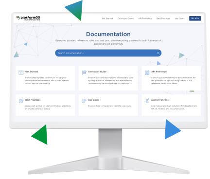

import bgImage1 from './illustration1.svg';
import bgImage2 from './illustration2.svg';
import Awards from '../src/components/awards.js';

<Hero />

<Grid>
  <Card variant="gradient" hoverable shadow bgImage={bgImage1}>

        ### Learn more about DocsKit 
        Discover the full potential of DocsKit! Explore our detailed specifications and descriptions to gain deeper insights into our features.
        
        <Button href="#">Discover DocsKit</Button>
  </Card>
  <Card variant="highlighted" hoverable shadow bgImage={bgImage2}>

        ### Closely examine DocsKit
        Access our GitHub repository to examine the source code and learn more about the technical implementation of our features. 

        <Button href="#">Access source code</Button>
  </Card>
</Grid>
  

## What’s included

<Grid>
  

    * Open-source Docs as Code documentation solution leveraging platformOS, a git workflow, and a static site generator
    * Fully customizable theme 
    * Editorial workflow 
    * Comprehensive how-to documentation for using the DocsKit
    * Templates for your documentation style guide, contributor guide, most-used content types 
    ------
    **Begin crafting your documentation**  
    on a codebase fine-tuned for optimal performance, accessibility, sustainability, and SEO.
  

  
</Grid>

## Our inspiration: the platformOS Documentation

<Grid>
  

  

    The [platformOS Documentation](https://documentation.platformos.com) provides onboarding, conceptual information, tutorials, examples, API references, use cases, and best practices to developers building their apps or sites on the Platform-as-a-Service (PaaS) framework that is platformOS. 

    Following the Docs as Code approach, it is built to accommodate constant iteration and collaboration — with our developer community being involved in all phases of our editorial workflow, the portal is quick to adapt to their ever evolving needs. 
  
    ------
    **Uncover the strategies**  
    behind our multi-award-winning platformOS Documentation and learn how to build your own. 
  
  

</Grid>

<Awards />

