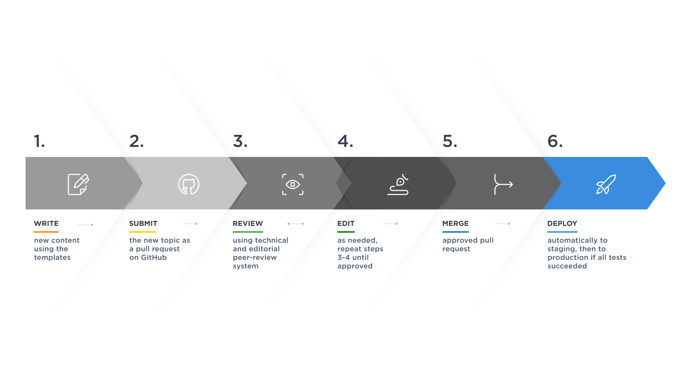

# Step 6: Deploying the final content

In the final step of the process, the merged content is deployed to a **staging environment**, referred to as **UAT** (User Acceptance Testing), where it undergoes comprehensive testing and review.
This critical quality assurance phase ensures that end-users consistently access the most polished and accurate version of your documentation.
Initially, the merged content is **automatically deployed to the UAT environment**, after which the site owner has the option to **manually trigger a production deployment** on GitHub to the live site.
Alternatively, an automated production deployment can be set up on request, simplifying the release process.