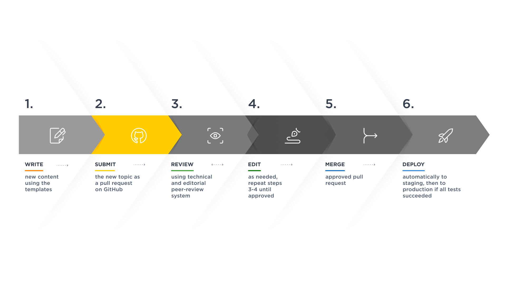

# Step 2: Submitting your content

When you finish writing your content in your editor, submit the new topic as a pull request on GitHub. This will notify the team to start the review process.

**Tip:** [GitHub Desktop](https://desktop.github.com/) is advisable to use when you want a user-friendly, graphical interface for interacting with Git and GitHub repositories. It is beneficial for individuals who are new to Git and version control. It provides an intuitive and easy-to-understand interface, making it less intimidating for beginners. GitHub Desktop is available for Windows and macOS, offering a consistent experience across both operating systems.

### Git Workflow

These are the steps of the git workflow when submitting your content. If you need help, check out [Committing and Reviewing Changes](https://docs.github.com/en/desktop/contributing-and-collaborating-using-github-desktop/making-changes-in-a-branch/committing-and-reviewing-changes-to-your-project-in-github-desktop) on the official GitHub documentation.

1. Commit changes
2. Push changes to your fork
3. Start a pull request (PR)
4. Fill out the PR form
5. Create the PR

<Message>Creating a PR will trigger GitHub Actions and automatically deploy your content to the **preview environment**.</Message>
