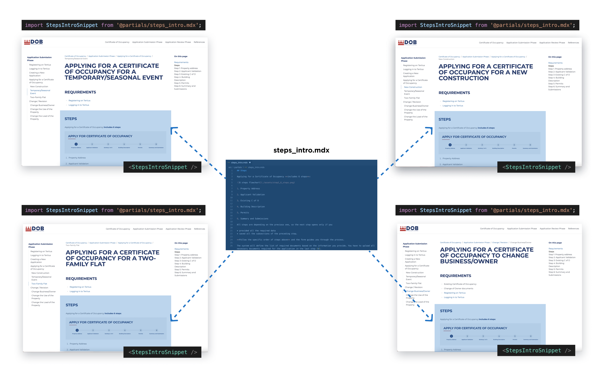

import bgImage from './assets/partials.svg';

<Card variant="hero" bgImage={bgImage}> 
# Single sourcing reusable content with DocsKit Partials
## Write once, use it everywhere.
</Card>

## Project overview

Single sourcing in technical writing is a methodology where content is created once and reused across multiple documents or platforms. This approach streamlines content management, ensuring consistency and efficiency, and simplifies updates in technical documentation.

DocsKit enables single sourcing through Partials, which are reusable content blocks (they can be paragraphs, images, or even entire chapters). These building blocks are stored in a central library (a single source) and can be easily inserted wherever you need them in your documentation.

DocsKit Partials empower writers to maintain a library of content snippets that can be updated once and reflected across all instances where they are used, significantly streamlining the process by avoiding repetitive updates, ensuring content consistency, reducing redundancy and enhancing accuracy throughout documentation.

<Card shadow variant="gradient">
## Summary

**Challenge:** Updating and reviewing repetitive content in documentation.  
**Solutions:** Single sourcing, creating a centralized reusable content library.  
**Results:** Streamlined updates, increased efficiency, enhanced consistency, and reduced review time.  
**Key Learnings:** The power of centralizing reusable content and its impact on documentation workflows.  
</Card>

## Problem statement

Our challenge was to maintain repetitive content within user guides, where identical pieces of texts or images are distributed across multiple locations and used many times. Updating the whole documentation became a complex task when a change was required, especially when we needed to ensure consistency across all instances.

From a reviewer's perspective, dealing with redundant pieces of texts can be a time-consuming task, often leading to the realization that the same content has been reviewed multiple times. Additionally, pinpointing inaccuracies and providing feedback for each occurrence becomes a complex and demanding process, which makes the documentation workflow cumbersome.


## Project goals
<br />

import icon1 from './assets/partials-goal1.svg'
import icon2 from './assets/partials-goal2.svg'
import icon3 from './assets/partials-goal3.svg'

<Grid cols="3">
  <Card variant="feature" shadow icon={icon1}>
    #### Streamline content creation
    Enable writers to compile a library of reusable content, facilitating single sourcing of paragraphs, images, or entire chapters to reduce the need to recreate the same content in multiple places and save time.
  </Card>
  <Card variant="feature" shadow icon={icon2}>
    #### Ensure consistency
    When updates are required, changes made to content in the centralized folder are automatically reflected in all instances throughout the documentation, ensuring that the information remains consistent and up-to-date.
  </Card>
  <Card variant="feature" shadow icon={icon3}>
    #### Simplify review process
    Partials not only benefit writers but also reviewers. Since the content is centralized, reviewers only need to review it once, reducing the time and effort required for the review process. This results in a more efficient and less burdensome review workflow.
  </Card>
</Grid>

## Challenges

The challenge extended to the necessity of manually updating content in multiple locations when changes were needed. The difficulty lay in finding the redundant text, and also in ensuring that every instance where the same piece of text was used was identified and updated, including all relevant resources, e.g., images, custom components, and visuals. Even minor modifications or updates, such as changing a few words incurred a significant cost in terms of time and mental energy from both the writer and reviewer.

There was a trial-and-error process, where reviewers would often leave notes requesting updates "at every occurrence." This left the writer with the frustrating burden of the responsibility of finding and updating every instance, which was a mentally taxing task. To compound the issue, recognizing the repetitive parts required a close familiarity with the whole documentation and its structure, which is sometimes not possible.


## Solution

DocsKit Partials allowed us to create a library of reusable content, whether it was a single sentence or a comprehensive chapter containing images and visuals, just like any other content crafted in MDX within DocsKit. Storing and maintaining reusable content elements at one place but using it in multiple instances saved time and also improved the overall user experience by ensuring that the documentation is accurate and up-to-date.

With Partials, we could update content once, and every instance throughout our documentation automatically reflected the change. We could maintain the content in a central library, then imported it and used it anywhere we wanted throughout the DocsKit site.

```jsx
import SharedContentSnippet from '@partials/common.mdx'
```

The reusable content parts are written in MDX and rendered the very same way using the same [formatting options](/documentation/markdown/) and [custom components](/documentation/components/) as any other part of the site.

## Results

We created user guides and technical documentation with unprecedented efficiency and consistency. Updates that once required significant effort and introduced the risk of errors became much easier.

This approach ensures that when updates or corrections are necessary in a specific part of the documentation, you only need to make those changes in our centralized content library. As a result, these updates are automatically applied across all instances where that content is utilized. Using DocsKit Partials reduces time spent during both the writing and the review process, because you only need to take care of the repetitive content part once, both when writing, editing, and reviewing.

Our documentation process was transformed, with every instance of reusable content-chunks instantly reflecting changes, ensuring accuracy and consistency.



*Partial utilized in the documentation of the District of Columbia Department of Buildings*

<Card variant="gradient">
  ## Key Learnings

  Our journey with DocsKit Partials has illuminated a path toward more efficient, consistent, and user-friendly technical documentation, using significantly less time and mental energy during the writing and review process.

  DocsKit Partials centralize your content, so you create it once and use it everywhere, eliminating the need for trial-and-error and manual updates. Single sourcing and managing reusable content is a significant advancement in the world of technical documentation, as it can help streamline the process of maintaining and revising user guides or longer technical documentation that have parts that are used in multiple places. Say goodbye to manual updates and welcome a new era of streamlined, consistent, and efficient documentation workflows.

</Card>
