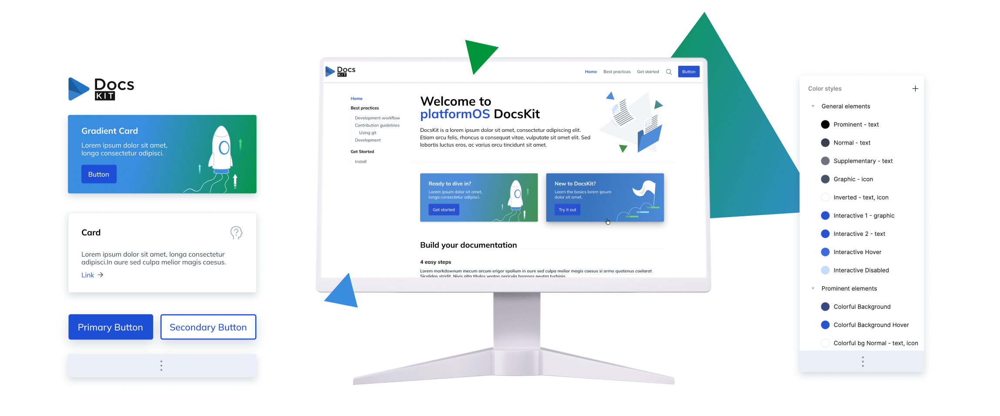
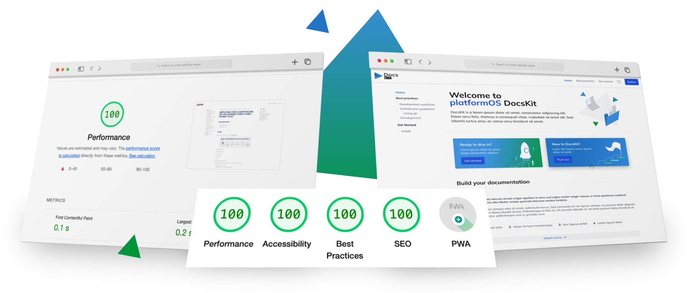

import bgImage from './assets/product-site.png';

<Card variant="hero" bgImage={bgImage}> 
# Building a multifaceted product site utilizing DocsKit’s built-in features
## Built for us, perfected for you
</Card>

## Project overview

We harnessed the capabilities of DocsKit, our all-in-one documentation solution, to build its product site. The site includes content for various target audiences, encompassing product information such as features, benefits, pricing, and documentation tailored for developers and editors.

<Card shadow variant="gradient">
## Summary

**Challenge:** Incorporating diverse content from various contributors while allowing for frequent updates and rapid publishing.  
**Solutions:** Utilizing DocsKit's Docs as Code methodology and CI/CD automation, we developed a scalable documentation site that is easy to update and maintain.  
**Results:** Using DocsKit for our site yielded exemplary performance, accessibility, SEO, and sustainability scores, with the site becoming an essential resource for users and the sales team.  
**Key Learnings:** Leveraging DocsKit for the site's construction allowed for real-time testing and helped us fine-tune and enhance various features of our product.  
</Card>

## Problem statement

We aimed to develop a product site for DocsKit that goes beyond just housing the standard product documentation. We wanted to provide additional information to help users gain a deeper understanding of DocsKit.
This necessitated designing a landing page more visually captivating than standard documentation portals. Furthermore, it was essential to incorporate diverse content types that weren't strictly documentation. 
Simultaneously, it was crucial to facilitate contributions from our team members in varied roles — be it sales, marketing, technical writing, or development — allowing them to enrich the product site based on their specific expertise.

Given our commitment to continually introducing new features to DocsKit and our dedication to user research for alignment with user needs, 
we needed a solution that allows for frequent updates — sometimes multiple times daily — and ensures a swift and stable publication process.

## Project goals
 

import icon1 from './assets/partials-goal1.svg'
import icon2 from './assets/partials-goal2.svg'
import icon3 from './assets/partials-goal3.svg'

<Grid cols="3">
  <Card variant="feature" shadow icon={icon1}>
    <h3 style={{ fontSize: '1.25rem', fontWeight: 'bold', margin: 0 }}>
      Showcase DocsKit features
    </h3>
    by highlighting its comprehensive capabilities and presenting a real-life example of a DocsKit site.
  </Card>
  <Card variant="feature" shadow icon={icon2}>
    <h3 style={{ fontSize: '1.25rem', fontWeight: 'bold', margin: 0 }}>
      Offer extensive documentation
    </h3>
    including detailed guides tailored for both developers and editors.
  </Card>
  <Card variant="feature" shadow icon={icon3}>
    <h3 style={{ fontSize: '1.25rem', fontWeight: 'bold', margin: 0 }}>
      Enhance engagement
    </h3>
    by creating avenues for potential users to easily contact us.
  </Card>
</Grid>

## Challenges

As we embarked on the journey of developing our product site, we faced a series of challenges, sparking solutions that benefited the entire DocsKit community.
- **Continuous assessment and integration:** As we used DocsKit to develop our own product site, we were concurrently evaluating its capabilities. Each time we pinpointed potential improvements, we had to promptly incorporate these enhancements into DocsKit itself.
- **Balancing performance with visuals:** It was crucial to maintain a perfect 100/100 GLH score on the site, even as we aimed to deliver visually rich and informative content.
- **Content planning tool:** For the landing page of our product site, we needed a method to coordinate content planning between our marketing and UI teams, ensuring alignment with the built-in custom components.

## Solution

### Editorial workflow
DocsKit's editorial workflow follows the Docs as Code approach. 
Documentation is crafted using the lightweight markup language MDX (an extension of Markdown), tracked through the version control system GitHub, and deployed via continuous integration/continuous deployment (CI/CD) pipelines. 

When it came to building the DocsKit product site, we found that the DocsKit editorial workflow was an ideal solution out of the box. 
It provided all the tools and features necessary for us to make frequent and secure updates to our content, preview the site with each change, and automatically deploy the latest version.

<Message filled>For an in-depth understanding of the DocsKit editorial workflow, explore our comprehensive [Editor Guide](/documentation/writing-editing-reviewing)</Message>

### Documentation
We have meticulously crafted comprehensive documentation tailored to our two primary target audiences:  
- **Developers**, who are responsible for building documentation sites using DocsKit, can access detailed information on various aspects, including [Markdown and MDX](/documentation/markdown/) usage, the mechanics of auto-generated navigation, custom components, theming, and customization.
- **For editors and reviewers** utilizing DocsKit, we've introduced an extensive Editor Guide. This guide provides a step-by-step breakdown of the editorial workflow, tool recommendations, best practices, and relevant links within the DocsKit documentation to facilitate a seamless user experience

### Search
The Gatsby ecosystem offers robust search capabilities through various plugins and techniques out of the box. Since DocsKit is built on Gatsby, it's fully compatible with more than 3000 Gatsby plugins.

DocsKit's search capabilities can be enhanced through third-party integrations like Algolia. Algolia provides a powerful hosted search service that can be seamlessly integrated with DocsKit sites, enabling advanced search features such as typo-tolerance and faceted search.

DocsKit sites can also implement search functionality by integrating local search plugins. These plugins index site content and offer fast, client-side search experiences for users.

For the DocsKit product site, we utilize the `gatsby-plugin-local-search` plugin to create search indexes during the build process. On the client side, we employ FlexSearch to process search terms and display results based on the generated search index.

### Automation
The DocsKit experience and the Docs as Code approach heavily rely on Continuous Integration and Continuous Deployment (CI/CD). Automation is integral to streamlining the editorial workflow and ensuring a seamless collaborative process for multiple team members working on the same documentation codebase.

For the DocsKit product site codebase, we leverage GitHub Actions to automate various tasks. This includes running code checks and code analysis, building and deploying site previews for every GitHub pull request, and deploying the accepted and merged changes to our User Acceptance Testing (UAT) environment. This automation significantly reduces manual intervention and accelerates the development and review process.

Deploying the latest code to the production environment is a straightforward process, requiring just a single button click on GitHub. This level of automation not only enhances efficiency but also minimizes the risk of human errors, ensuring that the documentation site is always up to date and in sync with the latest changes.

### Custom components
The DocsKit package comes with a set of pre-designed custom components that we could easily integrate into our MDX pages on the DocsKit product site. These elements, such as buttons, messages, and cards with various designs, enhance the visual appeal of our content and proved invaluable in highlighting essential information and calls to action.  
In instances where we required a custom component that wasn't part of the package, we designed and developed it, and promptly incorporated it into the DocsKit package for all DocsKit users to leverage.

import video from '../../src/images/customization.mp4';

<video
  width="1040"
  height="480"
  autoPlay
  loop
  muted
  className="mx-auto"
  aria-label="Demonstration of DocsKit custom components and customization options"
>
  <source src={video} type="video/mp4" />
  
</video>
[Learn more about our custom components here](/documentation/components/)

### Landing page content collector
The Landing Page Content Collector is a FigJam brainstorming board, that we designed for ideating the content of the product site's landing page. 
This board facilitates the promotion of content from the comprehensive documentation to the landing page in a structured format using pre-defined components.

Its objectives are:
- To facilitate visual thinking by offering the product's premade section components as building blocks. These are presented in a simplified, low-fidelity wireframe style.
- To ensure that the resulting design aligns with the product's established sections.

While specifically designed for the needs of DocsKit users, this board can be broadly used for brainstorming any landing page content or for crafting page layouts.
It is already available in the [Figma Community](https://www.figma.com/community/file/1293539081924182761), where it garnered significant interest within the first few days.

### Branded theme
We set up a custom theme for the project: applied the platformOS DocsKit branding to the default look of the product.

#### Customization included
- changing the logo
- changing the Color scheme to a custom color palette
- customizing the look of components according to the branding
- using custom components to create unique pages, like the Landing page or Case studies
- add pOS-branded custom visuals, graphics, icons, explanatory illustrations to the content

Learn more about [theming and customization here](/documentation/theming/).

### Engagement and integrations

Our model-based application development platform, [platformOS](https://www.platformos.com/), serves as the hosting environment for the DocsKit product site.
Once the static site generation process is complete, the generated site goes through a transformation process and gets turned into a fully functional platformOS application. 
This transformation allows us to seamlessly expand the site's capabilities with additional business logic and server endpoints offered by platformOS modules or custom code.

This approach allows both client-side and server-side code to coexist within the same codebase and environment, eliminating the need for third-party integrations, 
which often incur additional costs, subscription fees, and added complexity to the system.

We used this opportunity to create an API endpoint for the contact us page, enhancing the site's interactivity. 
But this approach doesn't prevent us from integrating external services when needed. For instance, we also leverage TheTrackApp for scheduling discovery calls.

Incorporating platformOS and selectively integrating external services, DocsKit offers a versatile and cost-effective solution for managing your documentation site's hosting, development, and integrations.

## Results
We are committed to constructing high-quality documentation sites, and with DocsKit, we aim to empower our users to elevate every facet of their documentation platforms. Leveraging DocsKit enabled us to achieve outstanding metrics on our product site, notably in performance, accessibility, sustainability, and SEO.

We consistently refine our product site in response to user feedback. It has proven invaluable for users navigating their DocsKit journey and has become an essential tool for our sales team. Our platformOS partners are already tapping into the product site's public GitHub repository. This [open-source resource](https://github.com/Platform-OS/docskit-landing) is available to anyone interested in exploring an exemplary DocsKit site.

<Card variant="gradient">
  ## Key Learnings
  In developing the DocsKit product site, we found that leveraging our own product, DocsKit, for the site's construction allowed for real-time testing and immediate enhancements.  
  This hands-on approach provided crucial insights into content coordination across diverse teams and allowed us to further streamline this process. Our choice to share our repository as an open-source resource emphasizes our focus on transparency, utility, and providing tangible examples for the DocsKit community.  
  As we move forward, the DocsKit site will continue to serve as a practical benchmark, showcasing the best practices in documentation site development.
</Card>
