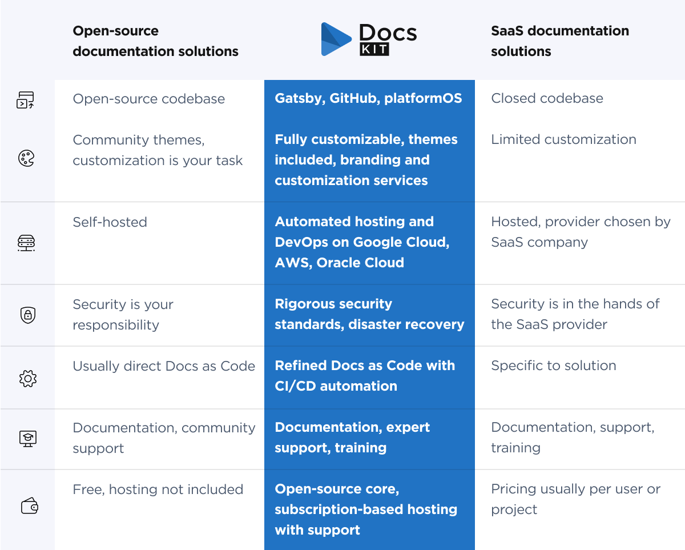

# Bridging the gap between open-source and SaaS documentation solutions

**DocsKit** is a tool that combines the best features of **open-source** and **Software as a Service (SaaS)** documentation solutions. It's designed for organizations that need a flexible, secure, and easy-to-use documentation platform.

## Open-source vs. SaaS solutions

* Open-source solutions are free and highly customizable. They're great for those who like to tweak and modify their tools, but they require more technical skill to set up and maintain
* SaaS solutions are easier to use and manage, but they're less flexible and can be more expensive

# DocsKit: The hybrid documentation solution

## Technology

**DocsKit** presents a unique hybrid model. It combines the open-source nature of tools like Gatsby and GitHub with the structured framework of platformOS. 

This blend offers the best of both worlds: the flexibility and adaptability of an **open-source** framework, along with the robust, scalable infrastructure typically associated with **SaaS** solutions.

## Customization

**Open-source** platforms allow for extensive customization with community themes, but users have to customize and maintain their sites themselves. 

**SaaS** documentation solutions typically provide a more straightforward, user-friendly experience with predefined themes and layouts, but this simplicity comes at the cost of flexibility and personalization. 

**DocsKit** offers the full spectrum of customization options, from ready-to-use themes to opportunities for creating branded themes and custom designs.

## Hosting and security

With an **open-source** documentation solution, the burden of DevOps and security lies with you.  

**SaaS** solution providers handle all aspects of hosting, including security and compliance leaving you without any control. 

**DocsKit** provides hosting with automated DevOps, and you can choose from reputable, eco-friendly hosting providers such as Google Cloud, AWS, or Oracle Cloud. 

## Workflow and usability

Several **open-source** documentation solutions support Docs as Code but require developers to establish hosting services and configure CI/CD pipelines. 

**SaaS** documentation solutions come with a predefined workflow setup preventing you from tailoring the workflow to meet specific needs or preferences. 

**DocsKit** presents a refined Docs as Code approach with built-in CI/CD automation allowing you to concentrate more on content creation and less on the technical complexities of documentation management.

## Support and training

**Open-source** documentation solutions generally come with extensive user documentation, but they often lack personalized support structures. 

Similarly to **SaaS** solutions, **DocsKit** provides a dedicated support team ready to assist users with their queries, and customized training sessions for developers and editors. 

## Pricing

**Open-source** documentation solutions, while free to use at the outset, can present hidden costs over time as they require teams to independently manage aspects like hosting, setup, integration, theme customization, and enhancements.

**SaaS** documentation solutions typically offer a user- or project-based pricing model. This approach can seem cost-effective initially, but as the project scales, the expenses can escalate.

**DocsKit’s** core is free and open source and comes with a subscription model for hosting on a platformOS instance. This subscription covers hosting and a set number of support hours. DocsKit also offers a range of paid services for setup, custom branding, and optimization in areas like accessibility, sustainability, and SEO. 

# Conclusion

DocsKit is a unique documentation solution, blending the customization of open-source with the ease of SaaS. It's suitable for a range of users, from those who need simple solutions to those requiring deep customization. With its combination of technology, workflow, and support DocsKit offers a flexible, secure, and user-friendly option for documentation needs.

<Grid>
  <Card variant="highlighted">
    ### Free Docs as Code course
    
    Perfect for beginners and those looking to refine their skills, this comprehensive course covers everything from the basics of Docs as Code to each step of the editorial workflow.

    <Button href="/docs-as-code-course" target="_blank">Sign up</Button>
  </Card>
  <Card variant="gradient">
    ### DocsKit discovery call

    Pick a time for a 20-minute discussion to explore how DocsKit can enhance your documentation and determine if it's the right fit for your projects.

    <Button href="https://calendar.thetrackapp.com/colin-frost/5939f8d5-c49e-4626-9e70-3f51aa599dcd" target="_blank">Schedule a call</Button>
  </Card>
</Grid>
