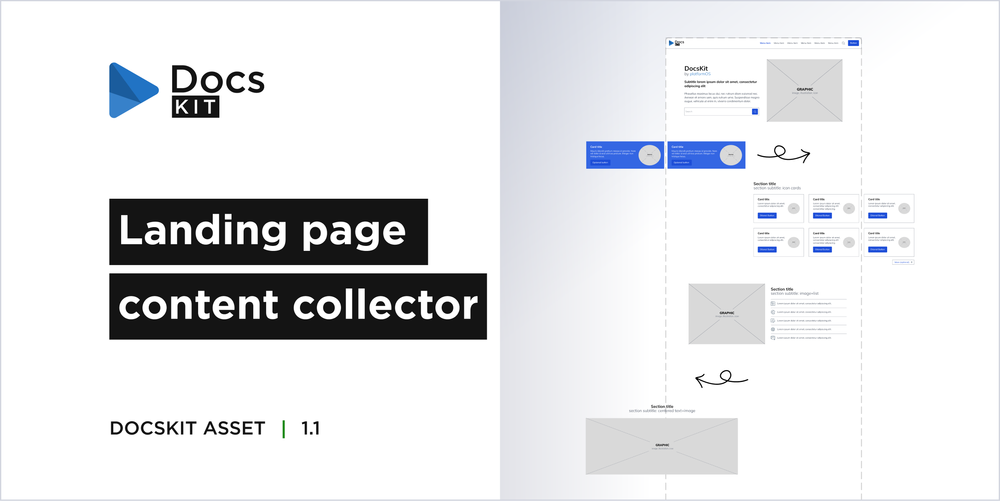
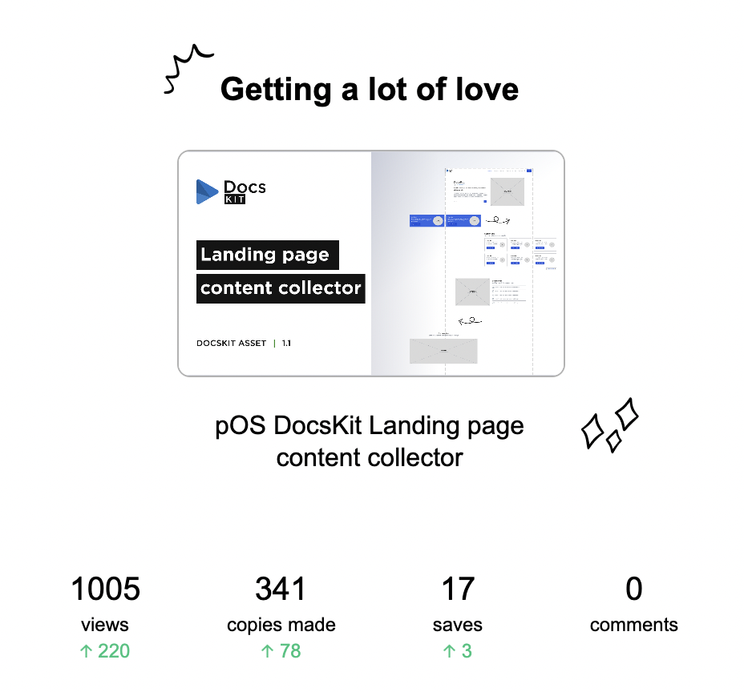

# Landing page content collector

 

We're excited to announce that our [Landing page content collector](https://www.figma.com/community/file/1293539081924182761) is now available in the Figma Community, where it has been attracting significant interest from the first few days onward.

## What is the Landing page content collector? 

The Landing Page Content Collector is a FigJam brainstorming board developed for non-designers.

It's designed for ideating the content of a Documentation site's landing page, which utilizes our [DocsKit](https://docskit.platformos.com/) solution. This board facilitates the promotion of content from the comprehensive documentation to the landing page in a structured format.

**Its objectives are:**

* To facilitate visual thinking by offering the product's premade section components as building blocks. These are presented in a simplified, low-fidelity wireframe style.
* To ensure that the resulting design aligns with the product's established sections.

**The board incorporates:**

* A Building block library which contains predefined page components and sections that you can use to create your desired layout and add your content.
* An empty landing page frame for ideation and iteration.
* Sample landing page layouts for quick content ideation.
* Comprehensive guide about the usage of the board.
* Helpful Figjam tips for beginners, accompanied by short tutorial videos.

**Predefined sections**

During brainstorming you can utilize the predefined, reusable sections in the Building block library to think about the visual presentation of the given content.

There are sample sections for content with more graphics, such as

* Hero section
* Image and text sections
* Full-width image section
* Logo list

And sections or components for text-heavy but aesthetically structured and organized content, like

* Cards
* Lists
* Resource lists

## Benefits

Discover the advantages of our Landing page content collector designed to enhance your content planning and design process:

* User-friendly **for non-designers**, as it is easier to use than a Figma kit.
* Supports content creation aligned with the ideation of the **matching graphic type**, even before the design phase.
E.g. For highly technical or less detailed content, it's often easier to find matching icons than create complex illustrations (e.g. features, benefits, etc.). However, well-presented, detailed content may benefit from using images, explanatory illustrations or screenshots.
* Helps determine the **optimal amount of content** for the given section to achieve a visually pleasing result. For example, ensuring a similar amount of text on each card.
* Assists in creating a well-balanced content with an **optimal text-graphic ratio**.
* Contains the most **common section layouts** for arranging typical content. Unique sections can also be added, but they require additional implementation effort.

## Downloads

The Figma source file that you can duplicate is available [here](https://www.figma.com/community/file/1293539081924182761/pos-docskit-landing-page-content-collector).

For additional Figma design resources by the platformOS team, visit our [Community profile](https://www.figma.com/@platformos).

While specifically designed for the needs of DocsKit users, this board can be broadly used for brainstorming any landing page content or for crafting page layouts and wireframes.
