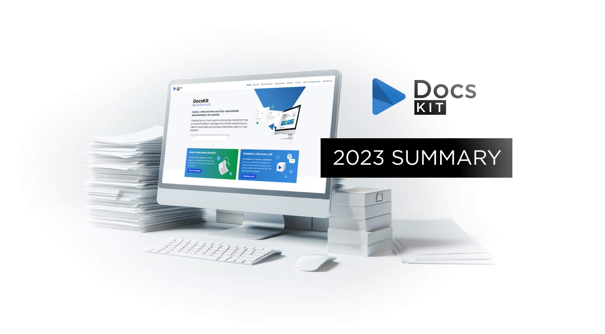
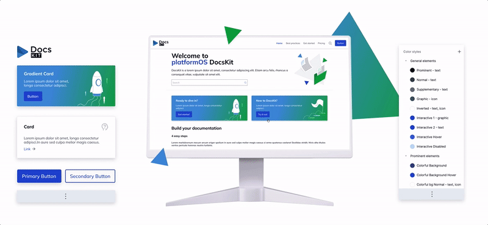
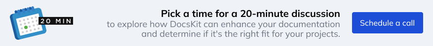

# 2023: A Year of Innovation and Growth for DocsKit

Reflecting on the incredible journey and growth we've experienced together in 2023, we can celebrate many significant milestones. The launch of our documentation platform, DocsKit is just the beginning, here's a summary of all the exciting highlights.

<Message variant="info">
  DocsKit is open-source, licensed under the terms of the Creative Commons Attribution 4.0 International License. Separately, platformOS offers a range of services, including setup, hosting, support, accessibility, sustainability, SEO, and performance packages.
</Message>

# User research

When we developed the award-winning [platformOS Developer Portal](https://documentation.platformos.com/), we conducted extensive research over several years into all aspects of documentation. This included its target audience, editorial workflow, features and functionality, accessibility, sustainability, and much more. We also delved into existing research and developed an **empathetic understanding of how end-users, technical writers, editors, and contributors interact with documentation**.

Using all this experience and research, we set out to build our own documentation solution to share with the platformOS partner community. Our goal was to ensure that a **customizable solution** covers all their documentation needs in a manner consistent with** industry standards and best practices**.

Of course, as always, we started with research again, conducting a competitive analysis and held discussions with documentation experts to shape our understanding of the ideal documentation solution for their needs. We continued user research at different development phases and haven't stopped. We hope that through this approach, we can consistently provide a documentation solution that exceeds our partners’ and clients' evolving needs.

# Development and launch

Based on previous and new research, we began developing the **architecture and features** of DocsKit. Integrating Gatsby, GitHub, and platformOS, we built a solution that can function both as a standalone documentation site hosted on platformOS or as part of the platformOS modules ecosystem. This integration means it  works seamlessly with other platformOS modules and kits. For example, it utilizes the platformOS DesignKit as its design system. Additionally, thanks to its Gatsby component, **DocsKit can integrate with any of the 3000+ Gatsby plugins.**

We **launched** DocsKit with a strong selection of features, enabling the creation of a complete documentation site, including an editorial workflow and automated CI/CD. During our soft launch, we reached out to partners for testing and feedback, and we have since incorporated all the feedback we received.

For instance, we made the **[GitHub repository for our DocsKit site public](https://github.com/Platform-OS/docskit-landing)**. Built entirely on DocsKit, this site’s code and automation are now open for exploration.

In preparation for the launch of our [Docs as Code educational series](https://docskit.platformos.com/docs-as-code-course/), we developed the **course module** as an extension to DocsKit. This module allows you to enhance your documentation site with video training and courses, along with downloadable content, and as a platformOS module, it can be used for any platformOS site.

# Design

In parallel with development, we've also crafted the theme included in the DocsKit package to ensure it offers a **fully customizable design, featuring an accessible and responsive theme**. Key features encompass SEO readiness, responsiveness, optimized images, automatically generated navigation, table of contents, and breadcrumbs. The theme leverages Gatsby's Shadowing API, empowering users to implement a custom color scheme. Everything in the DocsKit theme adheres to the naming and format conventions of platformOS's public design system, the platformOS DesignKit. Furthermore, DocsKit provides the flexibility to use the Shadowing API for extending or overriding built-in components, enabling a high level of customization. 

Out of the box, DocsKit offers a diverse selection of **pre-designed custom components** for use in MDx pages, enhancing the ease and efficiency of your documentation creation. Users also have the freedom to create unique versions of components, like the Button, by copying the original component file and adding customizations. 

To assist DocsKit users in conceptualizing the content for their documentation site's landing page, we have introduced the **[Landing Page Content Collector](https://docskit.platformos.com/articles/landing-page-content-collector/)**—a FigJam brainstorming board tailored for non-designers. This board simplifies the process of promoting content from the comprehensive documentation to the landing page in a structured format. As of the time of writing this article, the user base has grown to a commendable 630 users, and we are delighted to learn that our Landing Page Content Collector is proving valuable to its intended audience and likely beyond. While specifically crafted to meet the needs of DocsKit users, this versatile board can be widely utilized for brainstorming any landing page content or for designing page layouts. 

# Knowledge sharing

We believe that sharing knowledge is crucial for growth and innovation. Having gained a thorough understanding of documentation, we are happy to share our insights with DocsKit users and the broader documentation community.

* **DocsKit Developer Portal: **We began developing the [DocsKit Developer Portal](https://docskit.platformos.com/) simultaneously with the launch of DocsKit. Incorporating insights from research, feedback, and experiences with clients and partners, we are organically expanding our developer portal to become the most reliable resource for all DocsKit users. This year, our plan is to incorporate additional useful, practical information and real-world examples, along with offering straightforward onboarding through a DocsKit sandbox. 

* **Articles:** Our [articles section](https://docskit.platformos.com/articles/) covers a range of topics, from Docs as Code and documentation standards to best practices in technical writing. It includes:
   * Educational resources related to the core principles of technical writing.
   * DocsKit news, updates, and announcements.
   * Invitations to courses and webinars.

* **Case studies:** Our DocsKit site now boasts a dedicated [case studies section](https://docskit.platformos.com/case-studies/), offering valuable insights into the practical applications of DocsKit. We present two distinct types of case studies:
   * Feature case studies: Illustrating how specific DocsKit features address common challenges, complete with practical examples and code snippets.
   * Site case studies: Showcasing fully implemented DocsKit sites. 

* **University course: **We are currently working on a course curriculum for the University of Szeged, which will cover the entire product development life cycle for a PaaS application. platformOS serves as the main example, with DocsKit illustrating documentation, accessibility, and sustainability aspects. 

* **Docs as Code Fundamentals course: **Our [Docs as Code Fundamentals](https://docskit.platformos.com/docs-as-code-course/) course, starting in January 2024, provides a comprehensive understanding of Docs as Code. Ideal for beginners and those refining their skills, the course covers the basics to the editorial workflow. [Sign up for the course](https://docskit.platformos.com/user/register) to access videos for each lesson and participate in interactive webinars for deeper engagement with the instructor and our team.

# Partnerships 

**DocsKit is now accessible for any platformOS Partner**. Furthermore, we are actively collaborating to establish a **network of specialized partners** focused on DocsKit development for documentation sites. This initiative aims to provide clients with the option to choose a partner with expertise in DocsKit when they decide to create a DocsKit site. 

For clients interested in directly working with the DocsKit team, we've initiated **discovery calls** where we introduce key features and benefits, compare DocsKit with open-source and SaaS solutions, discuss integrations, showcase example DocsKit powered sites, and outline pricing.

These initiatives aim to empower individuals and organizations with the knowledge they need for effective and sustainable documentation practices. Stay connected with us for the latest updates and opportunities to enhance your documentation skills!
