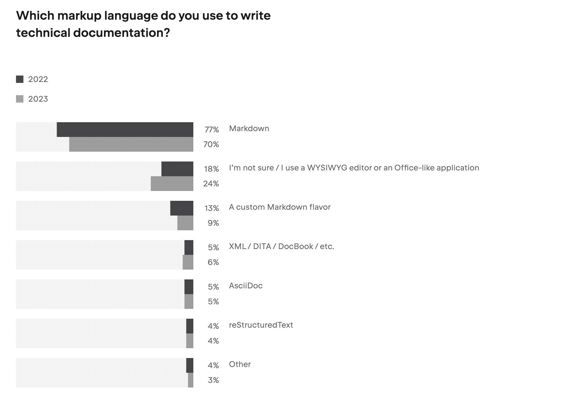

# The importance of high-quality developer documentation in 2024: Insights from last year's surveys

As a company dedicated to providing high-quality developer documentation for our community and developing our own documentation solution, DocsKit, we recognize the critical importance of understanding the evolving needs of users, particularly developers. In this article, we delve into the findings of various developer surveys conducted in 2023, aiming to gain deeper insights into the significance of high-quality developer documentation and a favorable contributor experience. 

## Developer survey highlights 

Exploring insights from three significant surveys, we gain valuable understanding into developer needs and industry trends, empowering us to stay informed and aligned with evolving requirements.

### Stack Overflow Developer Survey 2023

In May 2023, over 90,000 developers responded to [Stack Overflow’s annual survey](https://survey.stackoverflow.co/2023/) about how they learn and level up, which tools they're using, and which ones they want. Technical documentation and Stack Overflow remain top resources for learning to code. Developers value well-written documentation, an active community, and regular posts for effective self-teaching.

_Responses to the question 'What online resources do you use to learn to code?' in the Stack Overflow Developer Survey._

### Open-Source Community Survey by Intel

At the end of last year, Intel hosted a [survey of open-source developers](https://www.phoronix.com/news/Intel-2023-Survey-Results) to collect their feedback on various open-source software issues. Maintainer burnout, documentation/onboarding, and sustainability are top challenges faced by open-source developers. Intel’s survey highlights the importance of addressing these challenges to foster a healthy open-source ecosystem.

### The State of Developer Ecosystem 2023 by JetBrains

This report is the culmination of insights gathered from 26,348 developers from all around the globe. Within the [State of Developer Ecosystem Report](https://www.jetbrains.com/lp/devecosystem-2023/), you'll find information covering a wide range of topics, from programming languages, tools, and technologies to demographics and fun facts. The report emphasizes the critical role of documentation in shaping user-product relationships and highlights the need for improved collaboration and documentation quality. 

The State of Developer Ecosystem research delves deeply into the documentation aspect, highlighting the significant contribution of developers to documentation efforts, underscoring the importance of a good contributor experience. 

#### Markup

Regarding **markup languages**, Markdown remains the predominant choice. 

DocsKit utilizes MDX, an extension of standard Markdown, allowing for the integration of [pre-designed custom elements](https://docskit.platformos.com/documentation/components/) to make documentation pages more engaging.

#### Content reuse

While almost half of the respondents use a structured approach to **content reuse**, 32% still resort to copy and paste, potentially due to limitations in their tools. 

DocsKit addresses this by supporting content reuse through centralization and [single sourcing via DocsKit Partials](https://docskit.platformos.com/case-studies/docskit-mdx-partials/). 

#### Templates 

69% of respondents don't use **templates** to speed up writing, but of those who do, most use them for different document types. 

Templates are a powerful tool to streamline the documentation process and engage a wider community in content contribution while ensuring consistency. DocsKit provides MDX templates for commonly used content types. 

#### Automation

Despite the benefits of automated checks in technical documentation, only 13% of respondents utilize them. 

At DocsKit, we believe that automation plays a crucial role in the documentation process, significantly impacting the outcome of your work at every stage. Therefore, we integrate AI at various points in the editorial workflow and utilize a diverse array of configurable linters in the Docs as Code CI/CD workflow. 

import registrationBanner from "./assets/course-registration-banner.png";

## Conclusion

These surveys underscore the pivotal role of developer documentation in facilitating learning, fostering community engagement, and ensuring project sustainability. As we reflect on the insights gleaned, continuous improvement and innovation in documentation practices remain essential. At platformOS, we are committed to advancing the field of documentation and technical writing through our comprehensive DocsKit solution and expert services. By leveraging MDX for markup, supporting content reuse through DocsKit Partials, providing templates for streamlined writing, and integrating AI in our workflow, we aim to empower developers to overcome challenges highlighted by these surveys.
