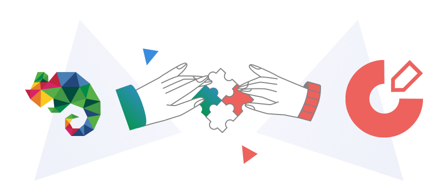

# Announcing partnership: platformOS DocsKit and EkLine

We are thrilled to announce an exciting partnership between platformOS DocsKit and [EkLine](https://ekline.io/), aligning two innovative platforms to enhance the landscape of documentation management. This collaboration aims to empower organizations with cutting-edge tools for creating, optimizing, and standardizing their documentation effortlessly.

## About DocsKit and EkLine

The **platformOS DocsKit** is a comprehensive documentation solution offering a seamless **Docs as Code editorial workflow**, including **automated DevOps** functionalities, encompassing preview, staging, and production sites. With the flexibility to extend using **platformOS modules** and over 3,000 **Gatsby plugins**, DocsKit empowers teams to craft and manage documentation with unparalleled ease and efficiency. 

DocsKit also allows for the integration of **linters** into the workflow, further improving quality control and adherence to standards. Integrating with EkLine further enhances this robust platform by introducing automated review features, facilitating seamless workflows for writers, editors, and reviewers alike. 

**EkLine** is an **NLP-powered platform** (Natural Language Processing) designed for automated content optimization and standardization. With its **AI-assisted** end-to-end solution, EkLine simplifies the process of document creation, review, and maintenance, ensuring content remains aligned with brand standards and consistently up to date.

EkLine offers a suite of tools to empower your documentation journey:

* **Plan and create**: Produce documentation content effortlessly with EkLine's AI-assisted LLM (Large Language Model).
* **Review**: Ensure consistency through NLP-based documentation review, enhancing quality and coherence.
* **Maintain**: Implement governance and maintenance protocols to keep documentation current and relevant. 

EkLine seamlessly integrates into various stages of the **platformOS DocsKit editorial workflow**, enhancing productivity and effectiveness. For example, it provides editorial assistance through its VS Code plugin, offering AI support during the editing process to optimize content for readability, consistency, and adherence to style guides. Additionally, EkLine has been seamlessly integrated into the CI/CD pipeline, enabling automated content optimization and standardization as part of the deployment process.

import discoveryCallBanner from "./assets/discovery-call-banner.png";

**platformOS** is a managed IDP (Internal Development Platform), helping build limitless applications with automated DevOps.  It powers solutions for Enterprise Innovation teams, Banks, Government, SaaS and Development Agencies.

## The partnership 

By teaming up with EkLine, the platformOS DocsKit solution, aims to enhance its documentation management capabilities further. By integrating EkLine's AI-powered content optimization and standardization features, DocsKit users can expect a seamless experience in creating, maintaining, and optimizing their documentation. 

This partnership consolidates the strengths of both platforms while underscoring a commitment to empowering organizations with best-in-class solutions for their documentation needs.

## In conclusion

The partnership between platformOS DocsKit and EkLine marks a significant milestone for both companies. Together, we offer a comprehensive suite of tools that automate documentation processes, ensure consistency, and optimize content quality, ultimately driving efficiency and productivity for organizations worldwide.

Stay tuned for more updates as we continue to innovate to meet the evolving needs of documentation management. 
