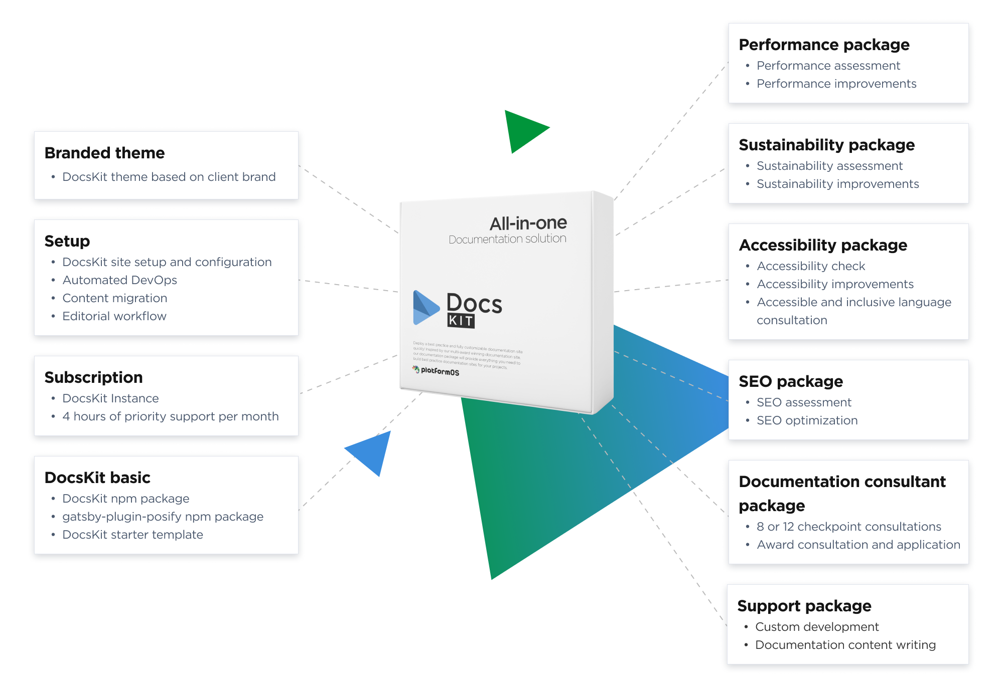

# Pricing

## Understanding DocsKit pricing — tailored assistance at every step

At DocsKit, we understand that every company's documentation needs are unique. That's why our pricing model is as flexible as our platform. We aim to provide as much or as little assistance as you require, ensuring you only pay for what you truly need.

* **DIY approach**: For those who are hands-on and prefer to take charge, our open-source version is a perfect match. For a monthly fee, you receive hosting, automated DevOps, and ongoing support. It's all about giving you the freedom to do things your way, backed by our robust infrastructure.
* **Comprehensive setup and configuration**: If you'd prefer us to take the reins, we offer a full site setup package. This includes content migration, editorial workflow, and ensuring everything is tailored to your specific needs.
* **Theming and branding**: While DocsKit offers a range of themes for you to choose from, we understand the importance of brand consistency. You have the liberty to customize our themes as you see fit. However, for those seeking something bespoke, our team can craft a branded theme that aligns seamlessly with your brand identity.
* **Expertise when you need it**: Whether it's enhancing accessibility, sustainability, performance, or SEO, our specialized team is ready to step in. Think of them as your go-to experts, ensuring every aspect of your documentation is polished and professional.
* **On-demand support and development**: Should you require a deeper level of assistance, we have a team of Senior UX/UI Professionals, Developers, Project Managers, Business Analysts, and more, all available at your request. Plus, our skilled Technical Writers can produce high-quality content in multiple languages, ensuring your global audience is catered to.
* **Ongoing consultation**: The journey of developing impeccable documentation is ongoing. Our expert documentation consultants are available for sustained support, guiding you every step of the way. They can even assist in preparing your documentation for awards and aid in the application process, celebrating and showcasing your dedication to excellence.

In essence, with DocsKit, you have a multitude of options at your fingertips. Whether you're a hands-on type or you'd prefer a comprehensive support system, our pricing is designed to provide maximum value for your specific needs.

## Subscription

<table className="pricing">
  <tbody>
    <tr>
      <td>
        - DocsKit Instance
        - 4 hours of priority support per month
        - Unlimited number of users and contributors 
      </td>
      <td>
        **$500 / month**

      </td>
    </tr>
  </tbody>
</table>

## Packages

<table className="pricing">  
  <tbody>

    <tr>
      <td>
        ### Setup
        - DocsKit site setup and configuration
        - Automated DevOps
        - Editorial workflow
        - Content migration 
        - Onboarding and training 
      </td>
      <td>
        **$3500**
      </td>
    </tr>
    <tr>
      <td>
        ### Setup with branded theme
        - DocsKit site setup and configuration
        - Automated DevOps
        - Content migration
        - Editorial workflow
        - Branded theme
      </td>
      <td>
        **$6300**   
      </td>
    </tr>
    <tr>
      <td>
        ### Branded theme
        - DocsKit theme based on client brand
      </td>
      <td>
        **$2800**
      </td>
    </tr>
    <tr>
      <td>
        ### Performance package
        - Performance assessment
        - Performance improvements
      </td>
      <td>
        **$3000**
      </td>
    </tr>
    <tr>
      <td>
        ### Sustainability package
        - Sustainability assessment
        - Sustainability improvements
      </td>
      <td>
        **$2500**
      </td>
    </tr>
    <tr>
      <td>
        ### Accessibility package
        - Accessibility check
        - Accessibility improvements 
        - Accessible and inclusive language consultation
      </td>
      <td>
        **$3500**
      </td>
    </tr>
    <tr>
      <td>
        ### SEO package
        - SEO assessment 
        - SEO optimization
      </td>
      <td>
        **$2000** 
      </td>
    </tr>
    <tr>
      <td>
        ### Total package a la carte
      </td>
      <td>
        **$17300** 
      </td>
    </tr>
    <tr className="highlighted">
      <td>
        ### All-in-one documentation solution 
        - DocsKit site with custom theme
        - Performance package
        - Sustainability package
        - Accessibility package
        - SEO package
      </td>
      <td>
        ### $15000
      </td>
    </tr>
  </tbody>
</table>

## support Package fees

<table className="pricing">
  <tbody>
    <tr>
      <td>
        Custom development in 32hr blocks  
        (Senior UX/UI/Devs/PM/Business Analyst)
      </td>
      <td>
        **POA**
      </td>
    </tr>
    <tr>
      <td>
        Documentation content writing  
        (Experienced Technical Writers, with multi-lingual options)
      </td>
      <td>
        **POA**
      </td>
    </tr>
  </tbody>
</table>

## Documentation consultant package

<table className="pricing">
  <tbody>
    <tr>
      <td>
        8 checkpoint consultation
      </td>
      <td>
        **$6000**
      </td>
    </tr>
    <tr>
      <td>
        12 checkpoint consultation
      </td>
      <td>
        **$8000**
      </td>
    </tr>
    <tr>
      <td>
        Awards consultation and application
      </td>
      <td>
        **$5000**
      </td>
    </tr>
  </tbody>
</table>
